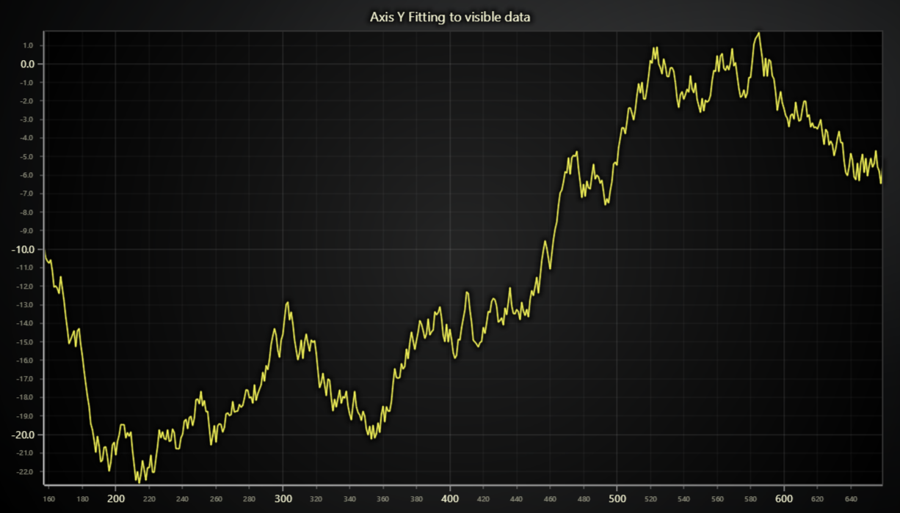

# JavaScript Visible Fitting Y Axis Chart

This demo application belongs to the set of examples for LightningChart JS, data visualization library for JavaScript.

LightningChart JS is entirely GPU accelerated and performance optimized charting library for presenting massive amounts of data. It offers an easy way of creating sophisticated and interactive charts and adding them to your website or web application.

The demo can be used as an example or a seed project. Local execution requires the following steps:

-   Make sure that relevant version of [Node.js](https://nodejs.org/en/download/) is installed
-   Open the project folder in a terminal:

          npm install              # fetches dependencies
          npm start                # builds an application and starts the development server

-   The application is available at _http://localhost:8080_ in your browser, webpack-dev-server provides hot reload functionality.

## Description

Example showcasing how active Y fitting to range of visible data points can be achieved in scrolling applications.

By default, the _fitting_ axis scroll strategy considers the full data set, not only the data points that are visible.

In some applications, this can be counter intuitive, which is why we created this example. This should provide a concrete reference on how this kind of "active fitting" can be implemented.

The idea is tracking the last couple of Y values and updating axis Y interval manually to only act according to the visible data points instead of entire data set.

## Participating in the development of LightningChart JS

In case this particular mode of axis fitting is especially interesting/important to you, please don't hesitate to [contact our support](https://lightningchart.com/support-services/) and share your very own requirements with us. As we've mentioned before, all our development is driven by user requirements so be sure to get your voice included!

## API Links

* [Chart XY]
* [Axis]
* [Line series]

## Support

If you notice an error in the example code, please open an issue on [GitHub][0] repository of the entire example.

Official [API documentation][1] can be found on [LightningChart][2] website.

If the docs and other materials do not solve your problem as well as implementation help is needed, ask on [StackOverflow][3] (tagged lightningchart).

If you think you found a bug in the LightningChart JavaScript library, please contact support@lightningchart.com.

Direct developer email support can be purchased through a [Support Plan][4] or by contacting sales@lightningchart.com.

[0]: https://github.com/Arction/
[1]: https://lightningchart.com/lightningchart-js-api-documentation/
[2]: https://lightningchart.com
[3]: https://stackoverflow.com/questions/tagged/lightningchart
[4]: https://lightningchart.com/support-services/

© LightningChart Ltd 2009-2022. All rights reserved.

[Chart XY]: https://lightningchart.com/js-charts/api-documentation/v4.2.0/classes/ChartXY.html
[Axis]: https://lightningchart.com/js-charts/api-documentation/v4.2.0/classes/Axis.html
[Line series]: https://lightningchart.com/js-charts/api-documentation/v4.2.0/classes/LineSeries.html

